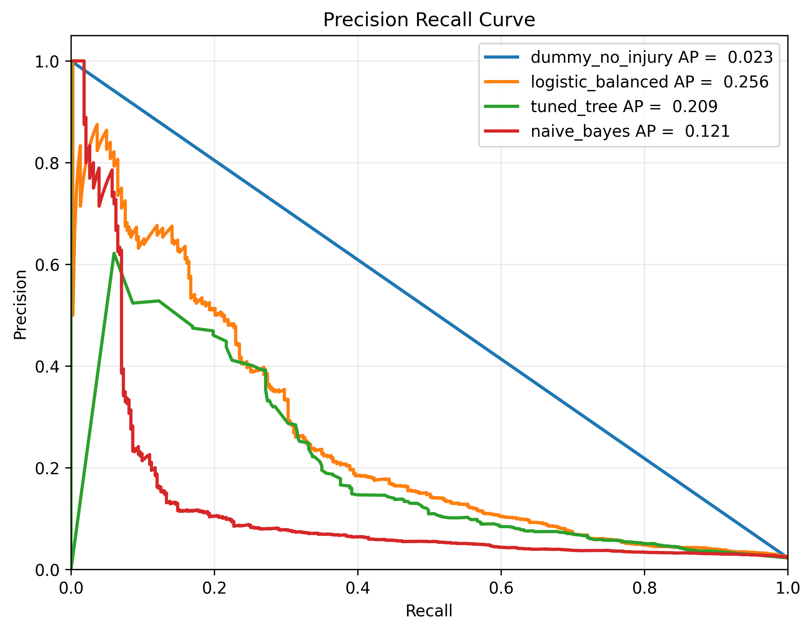
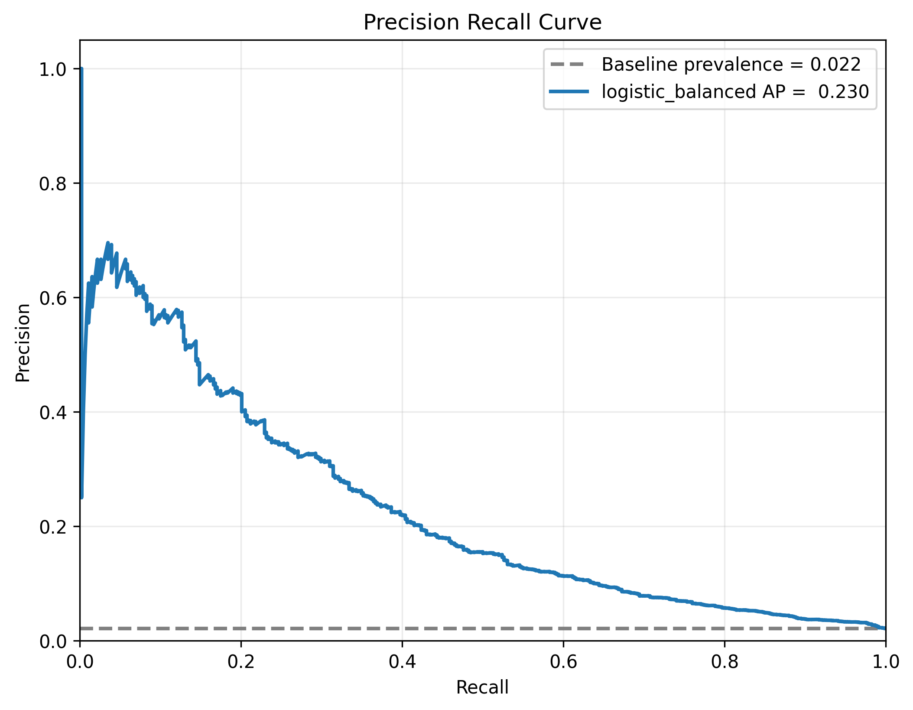

# Denver Motor Vehicle Accident Severity Prediction

An applied machine-learning project by Lily Holmes, Summer 2026.

This project uses public Denver traffic-crash records to model whether a crash involved a serious injury or fatality. The goal is not to present a production-ready public-safety system. The goal is to build a reproducible, end-to-end data science workflow around a real, messy, imbalanced dataset and evaluate the resulting classifiers honestly.

The project includes raw data extraction, cleaning, feature engineering, a geospatial speed-limit join, model comparison, threshold selection, and evaluation on a held-out temporal test set.


## Project summary

The modeling target is:

```text
injured = seriously_injured > 0 OR fatalities > 0
```

This is a rare-event classification problem. In the current validation split, serious-injury/fatal crashes make up about 2.3% of records. Because of that class imbalance, accuracy alone is not useful: a dummy classifier that predicts no injury for every crash is about 97.7% accurate while finding 0% of injury cases.

The project therefore emphasizes recall, precision, PR AUC, ROC AUC, and confusion matrices rather than accuracy alone.

### Motivation

The quick dispatch of emergency medical services (EMS) can make a critical difference after a severe crash. This project was inspired by a hypothetical system in which observable crash characteristics could supplement existing reporting systems and help reduce the time between a collision and the arrival of medical assistance.

For example, a traffic camera might observe a motorcycle and an SUV involved in a right-angle collision at the intersection of two high speed roadways at night, and flag a crash for immediate review. 

That scenario is an inspiration, not a claim about what this project achieved. The available data are retrospective police records, and several modeled features—such as driver actions and human factors—may only become known during or after a crash investigation. As the results below show, the model also produces too many false-positive alerts for deployment. 

>>> This project should be understood as a reproducible risk-classification study and portfolio project, not an operational public-safety tool.


## Data

The project uses open data from the City and County of Denver.

### Traffic Accidents

[Traffic Accidents](https://opendata-geospatialdenver.hub.arcgis.com/datasets/db00bd99ea534d8987e0913a191ebe19_325/explore?location=39.759262%2C-104.902794%2C10)

This source provides crash-level records, location fields, crash context, vehicle/action fields, and injury/fatality indicators.

### Street Centerlines

[Street Centerlines](https://opendata-geospatialdenver.hub.arcgis.com/datasets/street-centerlines/explore?location=39.778461%2C-104.843897%2C10)

This source is used to join speed-limit information onto crash records using spatial proximity.

Raw and interim data are not committed to the repository. The repository includes the SQL query needed to recreate the modeling extract and small sample files for reference.

## Pipeline

```text
raw geodatabase
-> SQL extract
-> cleaning
-> feature engineering
-> geospatial speed-limit join
-> modeling dataset
-> model comparison outputs
```

Main stack:

* Python
* pandas
* GeoPandas
* scikit-learn
* matplotlib

Model families:

* dummy baseline
* balanced logistic regression
* decision tree
* naive Bayes

## Evaluation design

The split is temporal:

```text
Train:      records through 2023
Validation: 2024 records
Final test: 2025 and later records
```

Model and threshold selection are performed on the validation split. The final test split is held out and should only be used after the modeling protocol is frozen.


### Validation results

The latest finalist comparison is saved in `output/metrics/best_models/`.

| Model | Threshold | Recall | Precision | Accuracy | F1 | ROC AUC | PR AUC |
|---|---:|---:|---:|---:|---:|---:|---:|
| dummy_no_injury | 0.50 | 0.000 | 0.000 | 0.977 | 0.000 | 0.500 | 0.023 |
| logistic_balanced | 0.48 | 0.704 | 0.079 | 0.804 | 0.142 | 0.841 | 0.266 |
| tuned_tree | 0.50 | 0.836 | 0.038 | 0.518 | 0.074 | 0.737 | 0.173 |
| naive_bayes | 0.10 | 0.504 | 0.072 | 0.840 | 0.126 | 0.746 | 0.147 |

The balanced logistic regression is the selected candidate because it provides the strongest validation PR AUC and a more usable recall/precision tradeoff than the tuned tree. The tuned tree reaches higher recall on validation but does so with much lower precision and accuracy.

For the selected logistic model at threshold `0.48`, the validation confusion matrix is:

```text
True negatives:  13,038
False positives:  3,124
False negatives:    112
True positives:     267
```

This result should be interpreted as a screening or risk-ranking exercise, not a standalone decision system. The model can identify many serious-injury/fatal crashes, but false positives remain substantial.



### Final test results

After the model family, feature set, filtering rules, and threshold were frozen using the validation period, the selected balanced logistic regression was refit on records through 2024 and evaluated once on the held-out 2025-and-later test set.

| Model | Threshold | Recall | Precision | Accuracy | F1 | ROC AUC | PR AUC |
|---|---:|---:|---:|---:|---:|---:|---:|
| Balanced logistic regression | 0.48 | 0.692 | 0.081 | 0.825 | 0.146 | 0.846 | 0.230 |

The final-test performance was broadly consistent with validation. Recall declined slightly, from 0.704 to 0.692, while precision, accuracy, F1, and ROC AUC remained stable or improved. PR AUC declined from 0.266 to 0.230. This suggests that the model generalized reasonably well to later records, but it does not make the model operationally useful.

At the frozen threshold of `0.48`, the final-test confusion matrix is:

```text
True negatives:  17,221
False positives:  3,575
False negatives:    141
True positives:     317
```

The model identified about 69% of serious-injury/fatal crashes, but only about 8% of its positive predictions corresponded to one. In an automatic EMS-dispatch scenario, that false-positive burden would be unacceptable. The final test therefore supports the narrower conclusion that this is a useful demonstration of rare-event modeling and honest temporal evaluation, not a system that should be deployed.




## Important limitations

This project is predictive, not causal. It does not estimate the causal effect of roadway design, speed limits, driver behavior, police district, or any other feature.

The model is not intended for legal, legislative, enforcement, insurance, or emergency-response decisions. It is an applied data science portfolio project that demonstrates reproducible workflow design, feature engineering, threshold-aware classification, and honest evaluation under class imbalance.

Known limitations include:

* serious-injury/fatal crashes are rare, which keeps precision low;
* crash reports may reflect reporting and data-entry patterns;
* several features may not be available at the time a real-world prediction would need to be made;
* geographic and district features may encode structural or operational differences that require careful interpretation;
* the false-positive burden and retrospective feature set do not support operational use.

## Repository structure

```text
.
├── data/
│   ├── raw/                  # Local raw database and road files, ignored by Git
│   ├── interim/              # Local pipeline intermediates, ignored by Git
│   ├── sample/               # Small sample files committed for reference
│   └── processed/            # Local processed outputs, ignored by Git
├── output/
│   └── metrics/
│       ├── individual/        # Per-family diagnostics, local/generated
│       ├── best_models/       # Finalist validation comparison outputs
│       └── final_test/        # Held-out temporal test metrics and plots
├── sql/
│   └── build_dataset.sql      # Query used to extract raw modeling data
├── src/
│   ├── pipeline/              # End-to-end pipeline stages
│   ├── cleaning_and_features/ # Cleaning, feature engineering, and geospatial helpers
│   ├── modeling/              # Model builders, split helpers, metrics, and plots
│   ├── individual_models/     # Per-family model runners
│   ├── audit.py               # Dataset inspection helpers
│   ├── paths.py               # Shared project paths and input validation
│   └── run_pipeline.py        # Main pipeline entry point
├── requirements.txt
├── LICENSE
└── README.md
```

## Reproducibility

Raw data files are not committed to this repository. To run the full pipeline, download the source data and place the files here:

```text
data/raw/traffic.geodatabase
data/raw/streetcenterlines.geojson
```

Clone the repository:

```bash
git clone https://github.com/lily-harper/injury_risk_classifier
cd injury_risk_classifier
```

Create and activate a virtual environment:

```bash
python3 -m venv .venv
source .venv/bin/activate
pip install -r requirements.txt
```

Run the main pipeline:

```bash
python -m src.run_pipeline
```

To also regenerate individual candidate-model diagnostics before the finalist comparison, run:

```bash
python -m src.run_pipeline --run-individual-models
```

To reproduce the frozen final-test evaluation, run:

```bash
python -m src.pipeline.run_final_test
```

The final-test command refits the already-selected model on the combined training and validation periods and evaluates it using the frozen threshold. It should not be used for additional model or threshold selection.

The pipeline checks for required raw files before running. Generated intermediate data are written under `data/interim/` and `data/processed/`. Model outputs are written under `output/metrics/`.

## Notes on...

### Project iterations

This project revisits a Denver traffic-crash dataset previously used in a STAT5000 project. The goal of that project was to apply foundational statistical procedures to a real-world dataset using R. I found the data interesting and had additional questions, so I returned to the source for a machine-learning project. The current iteration focuses on Python, reproducible pipelines, classification modeling, temporal evaluation, and project organization.

Related earlier project:

[Denver Car Accident Analysis](https://github.com/lily-harper/denver_car_accident_analysis/tree/main)

No AI was used in the first iteration.

For a future iteration, I would be interested in evaluating feature contributions, restricting the model to information genuinely available at prediction time, and exploring additional validation strategies. Any new model development would require a new untouched test period rather than further tuning against the test set reported here.

### AI assistance disclosure

OpenAI tools, including ChatGPT and Codex, were used during development for code organization, debugging, and documentation support for the current iteration.

All modeling choices, interpretations, limitations, and final project decisions are my responsibility.

> Not affiliated with the City and County of Denver. Please wear a seatbelt, drive safely, and follow roadway regulations.
